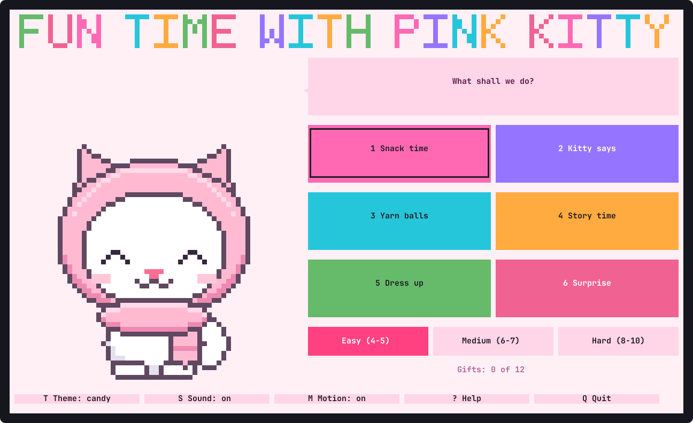

# funkitty

Fun time with Pink Kitty: little reading and typing games for young children, in the
terminal, on Linux and macOS.



Pink Kitty is a white kitty with a big round face and a light pink scarf over her head
and round her neck. She talks, out loud and in a speech bubble, and she is pleased with
everything a child gets right. A game takes a minute or two, ends in a party, and wins
her a gift to wear. Then the child can play another, or go and come back later.

- **Snack time.** A treat appears with something written under it. Type it and it
  flies to her mouth. "Yummy!"
- **Kitty says.** She says a letter or a word, and the child types it. On Hard the
  word is heard and not shown: spelling by ear.
- **Yarn balls.** Balls of yarn roll towards her, each with a letter. Press the letter
  and she pounces on it. One that gets past only rolls round again.
- **Story time.** A sentence with a word missing and three words to choose from. She
  reads the whole sentence out when it is right.
- **Dress up.** Twelve gifts to win, one for every game finished: a flower, a crown,
  glasses, a balloon, fairy wings, three patterns for her scarf and more. Put them on
  her and take them off again.

What it is like:

- **Three levels.** Easy (ages 4 to 5) is one letter at a time, with the key lit up
  on a keyboard drawn on the screen. Medium (6 to 7) is short words. Hard (8 to 10)
  is longer words and whole sentences.
- **Nothing can go wrong.** A wrong key costs nothing: she looks surprised for a
  moment and waits. There are no lives, no timer and no score to lose.
- **A celebration every time, and never the same one twice running.** Six little ones
  after each word (sparkles, hearts, a fountain of stars, music, confetti cannons, a
  ring of bubbles) and twelve parties for a finished game (confetti, fireworks,
  balloons, hearts, shooting stars, bubbles, a rainbow, a dance, a garden of flowers,
  a shoal of fish, a spiral, glitter), with five different tunes.
- **She speaks.** "Good job!", "Can you type cat?", every word and every story, in
  a recorded voice that is part of the program. Nothing is sent anywhere and no
  network is needed.
- **Mouse or keyboard, or both at once.** Everything on the screen can be clicked,
  the letters too, and everything has a key.
- **Big letters.** What a child has to read is drawn several rows tall wherever the
  window allows. A terminal cannot change its own text size, so for the smaller text
  make the window full screen and zoom in (usually `Ctrl` `+`).
- **Five color themes**, animations that can be switched off, and an opening with a
  tune.

## Install

funkitty runs on macOS and Linux, on Intel and ARM. It is a single program with
nothing else to install; the terminal needs UTF-8, which every current one has.

### Homebrew (macOS and Linux)

```sh
brew install anwarahmed/tap/funkitty
```

Update with `brew upgrade funkitty`, remove with `brew uninstall funkitty`.

### Install script

```sh
curl -fsSL https://raw.githubusercontent.com/anwarahmed/funkitty/main/install.sh | sh
```

This downloads the latest release for your machine, checks its checksum, and puts it
in `~/.local/bin` (set `FUNKITTY_BIN_DIR` for somewhere else). A copy installed this
way keeps itself up to date (see [Updates](#updates)). Where there is no prebuilt
binary it builds from source instead, which needs Rust. To remove the game:

```sh
curl -fsSL https://raw.githubusercontent.com/anwarahmed/funkitty/main/install.sh | sh -s -- --uninstall
```

### Arch Linux

Each [release](https://github.com/anwarahmed/funkitty/releases/latest) carries a
`PKGBUILD` for the package `funkitty-bin`. Download it into an empty directory and
build:

```sh
curl -fsSLO https://github.com/anwarahmed/funkitty/releases/latest/download/PKGBUILD
makepkg -si
```

Remove it with `sudo pacman -R funkitty-bin`. (The package is not in the AUR yet.)

### From source

Needs Rust 1.88 or newer.

```sh
git clone https://github.com/anwarahmed/funkitty
cd funkitty
cargo run --release
```

`./install.sh --source` builds and installs in one step; `./install.sh --link` links
`~/.local/bin/funkitty` to the checkout's build, for development.

## Updates

| Installed with | How it updates |
| -------------- | -------------- |
| Install script | By itself: when it starts it checks for a newer release, at most once a day, installs it and restarts |
| Homebrew       | `brew upgrade funkitty` |
| Arch package   | Build the newer `PKGBUILD` the same way |
| From source    | `git pull`, then build again |

Only the install script's copy updates itself. A copy that Homebrew or pacman owns is
marked as theirs when it is installed and never touches its own file, and neither does
a build run from a checkout.

For a copy that updates itself:

```sh
funkitty update        # check now and install a newer release
funkitty update off    # stop checking at startup ("on" turns it back on)
```

`FUNKITTY_NO_UPDATE=1` skips the check for one run. The check at startup happens at
most once a day (`funkitty update` always checks), waits at most three seconds, and
says nothing when you are offline. An update is verified against the release's
SHA-256 checksum and never moves to an older version; if anything fails, the version
you have starts as usual.

## Play

```sh
funkitty
```

| | Mouse | Keys |
|---|---|---|
| Choose a game | click it | `1` `2` `3` `4`, or arrows (`H` `J` `K` `L`) and `Enter` |
| Dress up, a surprise game | click them | `5`, `6` |
| Easy, medium or hard | click one | `E` |
| Type a letter | click it on the keyboard on the screen | the letter |
| Catch a ball of yarn | click the ball | its letter |
| Choose a word in story time | click it | `A` `B` `C` or `1` `2` `3`; on Easy, the letter itself |
| Hear it again | click **Say again** | `Tab` |
| Back to the home screen | click **Back** | `Esc` |
| Theme, sound, motion | click them | `T`, `S`, `M` |
| Help, quit | click them | `?`, `Q` |

On the home screen `Esc` does nothing, so that a child cannot leave by accident; `Q`
quits, and Pink Kitty waves goodbye.

For a grown-up setting it up:

- **The level** is chosen on the home screen and remembered. `--level easy|medium|hard`
  sets it from the command line.
- **Sound** needs nothing installed: it is played with `pw-play`, `paplay` or `aplay`
  on Linux and `afplay` on macOS, whichever is there. `S` switches everything off,
  her voice too. What she says is always in her speech bubble as well, so the game
  plays the same in silence; a word that would only be heard is then shown.
- **The gifts are kept** between runs. `funkitty reset` gives them all back, to be
  won again. When she has all twelve, a game wins a heart instead.
- **The window** needs to be at least 80 columns by 24 rows, which is the size a
  terminal usually opens at. Pink Kitty is drawn bigger from about 110 by 40, and the
  keyboard on the screen too.
- Options: `--theme candy|sunny|sky|mint|night`, `--sound on|off`,
  `--animations on|off`, `--no-intro`. `funkitty --help` lists everything.

## Files

| What | Where |
|---|---|
| Settings, the gifts, generated sound files, the time of the last update check | `~/.local/state/funkitty/` (`$XDG_STATE_HOME`) |

## The words and the voice

Everything a child reads, types or hears is in plain text files in [data/](data):
about 110 short words, 110 longer ones, 40 sentences, 56 stories and what Pink Kitty
says. They were written for this game with children of 4 to 10 in mind.

Her voice is 370 short clips in [voice/](voice), made once with
[Piper](https://github.com/rhasspy/piper), a text-to-speech program that runs on
your own computer, and then built into the game. [tools/voice.py](tools/voice.py)
makes them again when the words change.

## Development

```sh
cargo test                                   # unit tests
cargo clippy --all-targets -- -D warnings
cargo build --release && tests/e2e.sh        # the built program in tmux, install.sh, the updater
```

[CLAUDE.md](CLAUDE.md) describes how the code is laid out and why,
[docs/DESIGN.md](docs/DESIGN.md) how the game came to be designed this way, and
[RELEASING.md](RELEASING.md) how a release is made.

## License

MIT. See [LICENSE](LICENSE).
